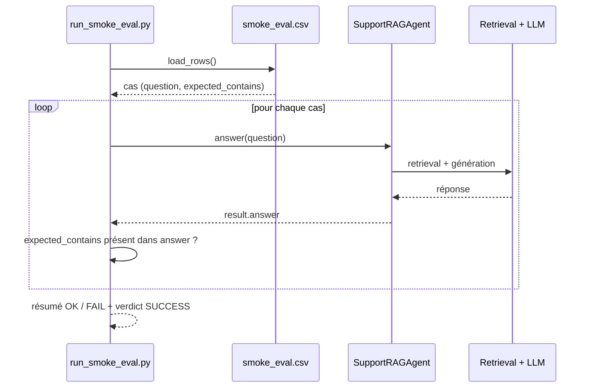

# 🛠️ TP 01 — Mise en place

## 📚 Ressources du TP

- Répertoire de travail : `eval/step1_setup`

---

## Objectifs

L'objectif ici est simple : **vérifier que ton environnement de workshop fonctionne** sur un cas d'évaluation basique et déterministe. Pas encore de LLM-as-a-judge — juste un smoke test pour confirmer que la chaîne complète tourne.

À la fin de cette étape, tu auras :
- Un environnement Python configuré et opérationnel
- L'application de test qui répond
- Un premier script d'évaluation qui passe

---

## Prérequis

Avant de commencer, assure-toi d'avoir :

- **Python 3.11+** → [téléchargement officiel](https://www.python.org/downloads/)
- **`uv`** (gestionnaire de packages Python rapide) → [installation uv](https://docs.astral.sh/uv/getting-started/installation/)
- **Un endpoint LLM compatible OpenAI** (LLM + embeddings) — le service et les clés sont fournies pour le workshop, mais tu peux les remplacer par les tiennes

---

## Étape 1 — Installer les dépendances

```bash
uv sync
```

`uv` lit le `pyproject.toml` et installe tout ce qu'il faut dans un environnement virtuel isolé.

---

## Étape 2 — Configurer le `.env`

Copie le fichier d'exemple et remplis les variables LLM :

```bash
cp .env.example .env
```

Ouvre `.env` et vérifie et complète les 2x3 variables obligatoires pour cette étape :

```
LLM_API_BASE=https://...    # URL de ton endpoint OpenAI-compatible
LLM_API_KEY=...             # Clé API (fournie pour le workshop)
LLM_MODEL=...               # Nom du modèle à utiliser

EMBEDDING_API_BASE=https://...
EMBEDDING_API_KEY=... 
EMBEDDING_MODEL=...
```

> [!TIP]
> Les clés LLM sont fournies pour le workshop — utilise-les telles quelles. Par défaut réutilise les mêmes valeurs pour `API_BASE` et `API_KEY` pour le LLM et l'EMBEDDING.
> Si tu préfères utiliser tes propres clés, tu peux remplacer ces valeurs.

> [!IMPORTANT]
> À cette étape, tu n'as besoin que des variables LLM et Embedding dans ton `.env`. Le reste de la configuration sera ajoutée plus tard.

---

## Étape 3 — Vérifier l'environnement

```bash
uv run python scripts/check_env.py
```

Ce script vérifie que toutes les variables sont présentes et que l'endpoint LLM répond. Si quelque chose cloche, il indique précisément quoi corriger.

⚠️ **Si ce script échoue**, ne passe pas à la suite — inutile de lancer l'app si l'env n'est pas bon.

---

## Étape 4 — Tester l'application support

```bash
uv run python -m app.cli "Comment réinitialiser mon mot de passe ?"
```

> [!NOTE]
> Rappel : c'est un agent de support technique, pose des questions dans ce thème (pour l'instant 😉)

Tu dois obtenir une réponse cohérente en français sur la réinitialisation de mot de passe. Si c'est le cas, l'app tourne correctement.

---

## Étape 5 — Implémenter le smoke eval

### 🔎 Objectif

On veut un **test simple et déterministe** : vérifier que la réponse de l'agent contient bien les **mots-clés attendus**. 

Le principe est volontairement minimal, et lisible via le `main()` dans [`eval/step1_setup/run_smoke_eval.py`](../eval/step1_setup/run_smoke_eval.py). Analyse le fichier et repère :

1. **Chargement du dataset** (`eval/step1_setup/datasets/smoke_eval.csv`) via `load_rows()`
2. **Lancement de l'app** sur chaque cas via `run_case()` à qui on passe les colonnes du dataset à utiliser.
3. **test du retour** (test inclus dans `run_case()` qui retourne OK ou FAIL).

> [!NOTE]
> Tout est **scripté en vanilla** (Python standard, pas de framework d'évaluation). Ce n'est pas le but à cette étape : on cherche surtout à valider que la chaîne complète tourne de bout en bout.

### 🔎 Déroulé du script




### ✅ Lancer le script de test

```bash
uv run python eval/step1_setup/run_smoke_eval.py
```

✅ Résultat attendu

- Une ligne `OK` pour chaque cas du dataset
- Un résumé avec le nombre de cas exécutés et un message final `SMOKE EVAL: SUCCESS`

---

> [!WARNING]
> Erreurs fréquentes pour le setup : 
>- Oublier de renseigner `LLM_API_BASE`, `LLM_API_KEY`, `LLM_MODEL` → le check env t'alertera
>- Lancer le script depuis un sous-dossier (pas la racine du projet) → les chemins relatifs cassent
>- Utiliser un provider différent de `openai_compatible`

---

## 🚀 Étape suivante

Ton env est opérationnel ! Découvre les familles d'évaluation : **[TP 02 — Fondations](./02-foundations.md)**
