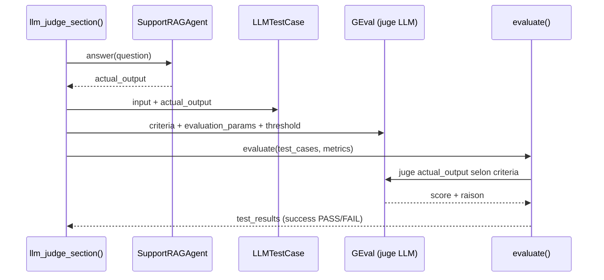
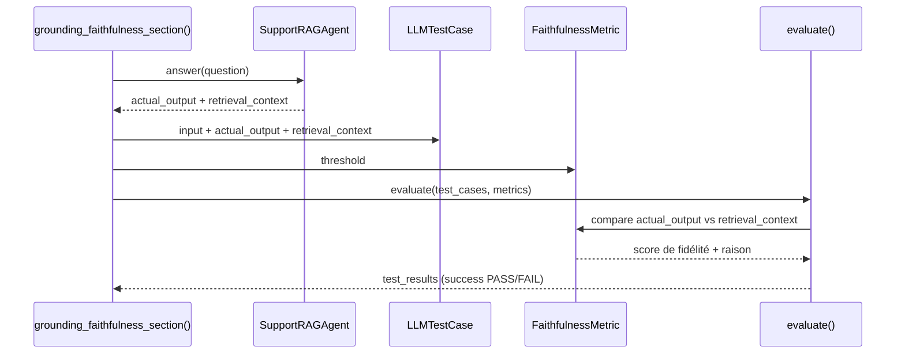

# 02 — Foundations

## 📚 Ressources du TP

- Répertoire de travail : eval/step2_foundations
- DeepEval docs (officiel) : [Overview](https://deepeval.com/docs/introduction), [LLM-as-a-Judge / GEval](https://deepeval.com/docs/metrics-llm-evals), [Grounding / Faithfulness](https://deepeval.com/docs/metrics-faithfulness).

> [!NOTE]
> Cette étape ne refait pas le setup d’environnement. Si ton env n’est pas prêt, repasse par le TP 01 - Setup.

## Introduction

Sur un vrai projet GenAI, la démarche d'évaluation suit un fil logique :

1. **Identifier les exigences** : qu'attend-on vraiment de l'app (qualité, sécurité, fidélité aux sources...) ?
2. **Choisir les types de tests adaptés** : chaque exigence peut demander d'appeler une famille d'évaluation différente.
3. **Mettre en œuvre une première version** : on code quelques cas et métriques pour avoir une boucle qui tourne.
4. **Commencer à expérimenter** : on lit les résultats, on ajuste, on mesure l'effet de chaque changement.

> [!NOTE]
> La **construction du dataset** (cas représentatifs, références attendues) est tout aussi déterminante que le choix des métriques. On l'aborde plus tard, dans les TP suivants. Ici, on travaille sur quelques cas codés en dur pour se concentrer sur les **familles d'évaluation**.

Pour notre cas d'usage — un **agent RAG de support IT** — deux familles de tests sont prioritaires :

- **LLM-as-a-Judge** : un LLM joue le rôle de relecteur qualité pour des critères qui ne s'expriment pas par une règle simple. Indispensable car ces exigences sont subjectives et dépendent du contexte métier.
- **Grounding** : on vérifie que la réponse reste **fidèle au contexte récupéré**, sans inventer. C'est central sur un RAG, où le risque principal est l'hallucination malgré une réponse bien rédigée.

### Pourquoi un framework d'évaluation ?

On pourrait tout écrire à la main (comme le smoke test du TP 01). Mais dès qu'on multiplie les cas et les critères, un framework apporte : des **métriques prêtes à l'emploi**, une façon **standardisée** de décrire les cas de test, un **seuil PASS/FAIL** homogène, et un **reporting** lisible et comparable d'un run à l'autre.

Dans ce workshop, on utilise **[DeepEval](https://deepeval.com)**.

> [!NOTE]
> **DeepEval** est un framework open-source d'évaluation pour applications LLM. Il permet d'écrire des tests sur les sorties LLM façon scripting ou tests unitaires au choix, avec 50+ métriques prêtes à l'emploi. Il est **local-first** : les évaluations peuvent tourner dans ton propre environnement, même si la doc fait souvent référence à Confident.ai (solution commerciale d'évaluation / observabilité s'appuyant sur DeepEval).

DeepEval propose deux modes d'usage :

- une variante orientée **pipeline / CI** avec `deepeval test run` + `pytest` (on la verra au **TP 03**) ;
- une variante orientée **scripting** avec la fonction `evaluate(...)`, qu'on utilise **dans ce TP** pour exécuter des cas et lire les résultats directement.

> [!TIP]
> **Alternative : Ragas.** C'est un autre framework d'évaluation, historiquement très orienté **RAG** et **métriques** (faithfulness, context precision/recall...). DeepEval couvre un périmètre plus large (agents, tool-use, sécurité, tests style Pytest, red-teaming) tandis que Ragas met l'accent sur une approche **experiments-first** et l'intégration avec LangChain / LlamaIndex. Les deux s'appuient sur des métriques LLM-as-a-judge ; le choix dépend principalement du périmètre (RAG seul vs agent complet) et de l'écosystème.

## LLM-as-a-Judge

### 🔎 Contexte

Le **LLM-as-a-Judge** consiste à confier à un LLM le rôle de **relecteur qualité** : on lui décrit un critère en langage naturel, il lit la réponse candidate et rend un verdict (score + raison). 

Exemples de critères typiques :
- ton professionnel,
- clarté de la réponse,
- présence d'une formule d'intro / conclusion,
- catégorisation du résultat dans des classes simples.

> [!NOTE]
> **Pourquoi avec DeepEval, le LLM-as-a-Judge s'appuie sur `GEval` ?** 
> 
> Un juge « maison » se résume souvent à un prompt du type « voici une réponse, est-elle professionnelle ? Réponds oui/non » : le format de sortie est libre, le score difficile à exploiter et instable.
> 
> [`GEval`](https://deepeval.com/docs/metrics-llm-evals) industrialise cette idée : à partir d'un **critère en langage naturel**, il génère une grille d'évaluation, demande au LLM de noter la réponse, et renvoie un **score normalisé `[0,1]` + une raison**, comparé à un **`threshold`** pour produire un verdict PASS/FAIL. 
> On obtient ainsi un résultat **structuré, reproductible et comparable**, là où un simple prompt+réponse reste artisanal.

Dans ce TP (arbo `eval/step2_foundations/`), on a préparé une fonction `llm_judge_section()` qui construit deux métriques `GEval` ("ton professionnel", et "présence d'intro+conclusion"), et qui encapsule chaque cas dans un `LLMTestCase`, puis qui lance `evaluate(...)`.



> [!NOTE]
> Les champs d'un `LLMTestCase` utiles pour un juge LLM :
> - `input` : la question utilisateur d'origine (ex : « Le VPN est indisponible, que dois-je faire ? »).
> - `actual_output` : la réponse réellement produite par l'agent (la « réponse candidate »), objet principal de l'évaluation.
> - `expected_output` : une réponse de référence (optionnelle), utile pour comparer à un attendu — cela suppose un dataset bien construit (on en reparle plus tard).
>
> `GEval` consomme explicitement les champs à juger via `SingleTurnParams` (`INPUT`, `ACTUAL_OUTPUT`...).

### ✅ Explorer le code

1. Ouvre `llm_judge_section()` dans `eval/step2_foundations/basic_eval_examples.py`.
2. Repère les 2 métriques `GEval` : `ProfessionalTone` et `AnswerStructure`.
3. Note les `evaluation_params` de chacune (ProfessionalTone utilise `INPUT` + `ACTUAL_OUTPUT`, AnswerStructure seulement `ACTUAL_OUTPUT` car pas besoin de la question pour vérifier une structure commune de réponse).

> [!NOTE]
> Mini mémo des fonctions DeepEval citées ici :
> - [`GEval`](https://deepeval.com/docs/metrics-llm-evals) : crée une métrique LLM-as-a-Judge à partir d'un critère en langage naturel et d'un seuil.
> - [`LLMTestCase`](https://deepeval.com/docs/evaluation-test-cases#llm-test-case) : encapsule le cas à évaluer (input, réponse, contexte éventuel).
> - [`SingleTurnParams`](https://deepeval.com/docs/metrics-llm-evals#evaluation-params) : indique à `GEval` quels champs du test case sont évalués.
> - [`evaluate(...)`](https://deepeval.com/docs/evaluation-introduction#evaluating-without-pytest) : exécute les mesures et retourne le résultat détaillé.

### ✅ Tester par soit même

👨‍💻 Des TODOs ont été ajoutés, **complète le code** :

1. `TODO-01` : réécris le critère du juge "**ton professionnel**" (propriété `criteria`), et demande au juge de bien vérifier les critères « professionnel + vouvoiement »
2. `TODO-02` : réécris le critère **présence intro/conclusion** avec des consignes complètes et non ambiguës pour contrôler la présence de ces 2 éléments.

> [!NOTE]
> Pour exécuter cette section du script, lance :  
> ```bash
> uv run python eval/step2_foundations/basic_eval_examples.py --section judge
> ```
> Observe l'output du test, les résultats sont structurés et détaillés. Ca facilite l'interprétation (géré par le framework DeepEval).

> [!WARNING]
> Le test **présence intro/conclusion** devrait normalement échouer... Il manque une instruction dans le prompt de l'agent.
> 
> `TODO-02-BIS` : Complète le `SYSTEM_PROMPT` de l'agent dans `app/prompts.py` pour ajouter l'instruction de démarrer par une introduction (avec le mot "Bonjour" par exemple).


👨‍💻 **BONUS : Teste des variantes** :

Pour bien comprendre l'effet d'un critère, provoque volontairement des PASS et des FAIL :

- **Modifier le prompt de l'agent** : ajoute / supprime des instructions pour faire passer / échouer les juges.
- **Modifier les prompts des juges** : faire évoluer les instructions du juge pour durcir ou élargir les contrôles.
- **Jouer sur le `threshold`** : baisse-le (ex. `0.5`) pour rendre le gate plus permissif, monte-le (ex. `0.9`) pour le durcir.

⚠️ Modifie un paramètre à la fois !

> [!NOTE]
> Dans le cadre de ce TP, l'agent (le system prompt) est très simple, et le modèle utilisé pour le juge dans ce TP est volontairement "modeste".
>
> Ce n'est donc pas étonnant de voir peu de changement lors des différents tests.

> [!TIP]
> Si le critère du juge est flou, le score devient **bruité** (instable d'un run à l'autre). Sois explicite sur ce qui doit passer ou échouer.


⚠️ Même une réponse bien rédigée peut **halluciner**. Pour un cas d'usage métier, il faut donc aussi vérifier son **ancrage dans les sources récupérées** → c'est l'objet de la section suivante.

---

## Grounding

### 🔎 Contexte

Le **Grounding** répond à une question simple : « **la réponse reste-t-elle fidèle au contexte récupéré ou consulté ?** ». Autrement dit, l'agent s'appuie-t-il réellement sur les passages remontés par le retrieval, sans rien inventer ?

C'est **important sur un cas d'usage RAG** : le risque principal n'est pas une réponse mal écrite, mais une réponse fluide et convaincante qui **ajoute des informations absentes du contexte** (hallucination).

Dans ce TP, on utilise la métrique DeepEval `FaithfulnessMetric`, qui mesure la fidélité de la réponse vis-à-vis du `retrieval_context`. La fonction `grounding_faithfulness_section()` récupère la réponse **et** le contexte de l'agent, les place dans un `LLMTestCase`, puis lance `evaluate(...)`.



> [!NOTE]
> Le champ clé ici est `retrieval_context` : la liste des passages récupérés sur lesquels la réponse doit s'appuyer. Sans lui, la métrique de faithfulness n'a rien à comparer.


🔎 **D'où vient le `retrieval_context` ?** On part de l'hypothèse que **notre agent est bien conçu**, et expose lui-même la réponse **et** les passages qu'il a récupérés pour la produire. C'est une **bonne pratique** (appliquée par tous les frameworks standards) : un agent qui retourne son contexte de récupération est bien plus facile à évaluer et à tracer (on reverra ce point en parlant observabilité au TP 04).

On a modélisé cela dans `get_agent_answer_and_context(question)`, qui appelle l'agent et renvoie le couple `(answer, retrieval_context)` directement exploitable dans un `LLMTestCase`.

> [!NOTE]
> Mini mémo :
> - [`FaithfulnessMetric`](https://deepeval.com/docs/metrics-faithfulness) : mesure si la réponse reste fidèle aux sources (pas d'ajout non supporté par le contexte).
> - [`LLMTestCase`](https://deepeval.com/docs/evaluation-test-cases#llm-test-case) avec `retrieval_context` : fournit au juge les passages à vérifier.
> - [`evaluate(...)`](https://deepeval.com/docs/evaluation-introduction#evaluating-without-pytest) : exécute la métrique et fournit le verdict PASS/FAIL selon le seuil.

### ✅ Explorer le code

1. Lis `grounding_faithfulness_section()` dans `eval/step2_foundations/basic_eval_examples.py`.
2. Repère comment `answer` et `retrieval_context` sont récupérés ensemble depuis l'agent via `get_agent_answer_and_context(question)`.
3. Plus de détails dans la [documentation DeepEval FaithfulnessMetric](https://deepeval.com/docs/metrics-faithfulness).

> [!NOTE]
> Autres métriques utiles de la même famille (Grounding / RAG) :
>
> | Métrique DeepEval | Ce que ça mesure | Quand l'utiliser |
> |---|---|---|
> | [`Answer Relevancy`](https://deepeval.com/docs/metrics-answer-relevancy) | Si la réponse répond vraiment à la question | Réponses hors-sujet, même « factuellement correctes » |
> | [`Contextual Relevancy`](https://deepeval.com/docs/metrics-contextual-relevancy) | Si le contexte récupéré est pertinent pour la question | Retriever qui remonte de « bons » documents mais pas les bons |
> | [`Contextual Precision`](https://deepeval.com/docs/metrics-contextual-precision) | La proportion de contexte récupéré réellement utile | Réduire le bruit dans les chunks récupérés |
> | [`Contextual Recall`](https://deepeval.com/docs/metrics-contextual-recall) | Si le retrieval couvre les infos nécessaires | Réponses incomplètes faute de contexte |
>
> Autre formulation :
> - `Faithfulness` = « La réponse invente-t-elle des faits ? »
> - `Answer Relevancy` = « La réponse répond-elle à la question ? »
> - `Contextual Relevancy / Precision / Recall` = « A-t-on récupéré le bon contexte, avec le bon niveau de bruit/couverture ? »

### ✅ Tester par soit même

👨‍💻 Un TODO a été ajouté, **complète le code** :

1. `TODO-03` : calibre le seuil de faithfulness en définissant un niveau de risque acceptable. Consulte la doc de la métrique si besoin.

> [!NOTE]
> Pour exécuter cette section du script, lance :  
> ```bash
> uv run python eval/step2_foundations/basic_eval_examples.py --section grounding
> ```

Avec la question posée dans le test ("Comment diagnostiquer un incident VPN ?"), le résultat devrait être très bon, car les infos sur la gestion des VPN est dans la base de connaissance (voir les fiches sous `app/data/knowledge_base`), et les infos sont donc chargées dans le `retrieval_context`.

N'hésite pas à tester d'autres questions en prenant un thème qui n'existe dans les fiches (ex: `AWS`, `Claude Code`, ...).


> [!WARNING]
> Un seuil **trop bas** laisse passer des approximations (hallucinations tolérées). Un seuil **trop haut** peut bloquer des réponses pourtant utiles.


## Solution

> [!TIP]
> Le but de l’étape n’est pas d’obtenir 100% de vert. Le but, c’est de comprendre **pourquoi** un test échoue et **quelle action produit une amélioration mesurable**.

Si tu veux comparer ton résultat : `eval/solutions/step2/basic_eval_examples_solution.py`
