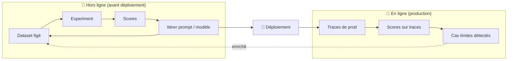

## 🚀 TP 04 - Observabilité & évaluation en ligne

Dans les TP précédents, on a fait de l'évaluation **hors ligne** : on jouait des datasets figés, préparés à l'avance, pour mettre au point ou faire évoluer un cas d'usage. C'est exactement ce qu'on fait quand on développe ou qu'on prépare une mise en production.

Dans ce TP, on s'attaque à deux sujets complémentaires :

- **S'appuyer sur un service externe** pour tracer, versionner et analyser ses évaluations dans le temps.
- **L'évaluation en ligne** : comment évaluer des données de la vraie vie, c'est-à-dire des **traces de production**, en live ou en asynchrone — et le lien avec l'**observabilité**.

Pour cela, on s'appuie sur **Langfuse**.

> [!NOTE]
> **Langfuse**, c'est quoi ?
>
> Langfuse est une plateforme open-source d'**observabilité et d'évaluation** pour les applications LLM. Elle est aujourd'hui un outil de référence du domaine. Elle permet de :
> - **tracer** chaque exécution de ton app IA (entrées, sorties, appels LLM, tokens, coûts, latence) ;
> - **évaluer** ces exécutions (scores humains, LLM-as-a-Judge, scores calculés par ton code) ;
> - **versionner** des datasets et comparer des expérimentations dans le temps.
>
> Langfuse se décline en deux formats : une version **cloud** managée avec un **free tier** (idéal pour démarrer, c'est ce qu'on utilise dans ce TP), et une version **open-source auto-hébergeable** quasiment aussi riche en features, que tu peux déployer chez toi/sur ton infra.
>
> Doc officielle : [Observability](https://langfuse.com/docs/observability/overview) · [Evaluation](https://langfuse.com/docs/evaluation/overview)

> [!IMPORTANT]
> Ce TP est **autonome** : il peut se lancer indépendamment des TP 01 à 03.

---

## Hors ligne vs en ligne

Langfuse documente très bien la notion de **boucle d'évaluation continue** ([Core Concepts](https://langfuse.com/docs/evaluation/core-concepts)) :

- **Évaluation hors ligne (offline)** : tu testes ton application contre un **dataset figé** *avant* de déployer. Tu fais tourner un nouveau prompt / modèle sur des cas de test, tu regardes les scores, tu itères, puis tu déploies. → C'est ce qu'on a fait aux TP 02 et 03 avec le framework DeepEval (les **Experiments** dans Langfuse).
- **Évaluation en ligne (online)** : tu **scores les traces de production** en temps réel ou en asynchrone, pour détecter les problèmes sur du vrai trafic. Quand tu trouves un cas limite que ton dataset ne couvrait pas, tu le rajoutes au dataset pour que les futures évals offline le capturent.



> [!NOTE]
> Le point commun des deux mondes : les **Scores**. C'est l'objet universel de Langfuse pour stocker un résultat d'évaluation, qu'il vienne d'un humain, d'un juge LLM ou d'un calcul de ton code. C'est ce qui permet de **suivre la qualité dans le temps**.

Dans ce TP, on part d'une **vraie trace** comme « dataset en ligne », et on lui rattache un score d'évaluation Judge.

---

## 📚 Ressources du TP

- Répertoire de travail : `eval/step4_production`
- Application instrumentée : `app` 
- Langfuse Cloud (instance Europe) : [cloud.langfuse.com](https://cloud.langfuse.com)
- Docs : [Tracing](https://langfuse.com/docs/observability/overview) · [Intégration OpenAI](https://langfuse.com/docs/integrations/openai) · [Scores via SDK](https://langfuse.com/docs/evaluation/evaluation-methods/scores-via-sdk) · [Score Analytics](https://langfuse.com/docs/evaluation/scores/score-analytics)

---

## Étape 1 - Découvrir Langfuse

### ✅ Créer un compte et un projet

1. Rends-toi sur l'instance **Europe** : [cloud.langfuse.com](https://cloud.langfuse.com).
2. Crée un compte (ou connecte-toi).

### ✅ Générer une API Key

Récupère directement les valeurs des variables sur l'écran qui suit le premier login. Sinon :

1. Dans ton projet, va dans **Settings → API Keys**.
2. Clique sur **Create new API keys**.
3. Note les **3 valeurs** affichées (la clé secrète n'est montrée qu'une fois) :
	- `Secret Key` → `LANGFUSE_SECRET_KEY`
	- `Public Key` → `LANGFUSE_PUBLIC_KEY`
	- `Host` → `LANGFUSE_BASE_URL` (ici `https://cloud.langfuse.com`)

4. Copie ces 3 variables dans ton fichier `.env`, ET passe à `true` la variable `LANGFUSE_TRACING_ENABLED`:

```bash
LANGFUSE_TRACING_ENABLED=true
LANGFUSE_PUBLIC_KEY=pk-lf-...
LANGFUSE_SECRET_KEY=sk-lf-...
LANGFUSE_BASE_URL=https://cloud.langfuse.com
```

5. Vérifie que tout est en place :

```bash
uv run python scripts/check_env.py
```

### ✅ Se repérer dans les menus

Prends 2 minutes pour explorer la barre latérale de Langfuse. Les sections clés pour ce TP :

| Section | À quoi ça sert |
| --- | --- |
| **Home** | Vue d'ensemble (volume, coûts, latence, scores) |
| **Observability → Tracing** | Liste des traces (une exécution end-to-end de ton app) |
| **Evaluation → Scores** | Tous les scores rattachés aux traces (c'est notre cible !) |
| **Evaluation → Datasets** | Jeux de cas de test versionnés, pour les Experiments (offline) |

---

## Étape 2 - Instrumentons l'application

### Objectif

Du **tracing** a déjà été ajouté à l'application pour que chaque exécution remonte dans Langfuse.

Le tracing était inactif tant que les variables d'env n'étaient pas définies (et que `LANGFUSE_TRACING_ENABLED` était à `false`).

### 🔎 Comment instrumenter une application

Une bonne trace de base doit avoir :

- un **nom descriptif** (`support-rag-agent`, pas `agent-1`) ;
- le **modèle** et l'**usage de tokens** (capturés automatiquement par l'intégration) ;
- une **hiérarchie de spans** quand il y a plusieurs étapes ;
- des **entrées/sorties lisibles** (la question et la réponse, pas tous les arguments internes).

### 👨‍💻 Ce qu'on a instrumenté dans `app`

1. **Intégration native OpenAI** : Chaque appel LLM est tracé automatiquement (modèle + tokens) avec le drop-in `langfuse.openai` (sorte de wrapper autour de la lib openai).
2. **Décorateur `@observe`** sur la méthode `answer()` de l'agent : ça crée la **trace racine** nommée `support-rag-agent`.
3. **Entrées/sorties de trace** explicites (question → réponse) pour une lecture claire dans l'UI.
4. **`flush()`** en fin de programme : indispensable dans un script court, sinon les traces ne partent jamais.

<details>
<summary>Voir les modifications (cliquer pour afficher)</summary>

`app/llm.py` — un seul import change :

```python
# Avant
from openai import OpenAI
# Après (drop-in : tout appel est tracé)
from langfuse.openai import OpenAI
```

`app/rag_agent.py` — décorateur + IO de trace :

```python
from langfuse import get_client, observe

@observe(name="support-rag-agent")
def answer(self, question: str) -> AgentResult:
    ...
    client = get_client()
    client.set_current_trace_io(input=question, output=final_answer)
    client.update_current_span(metadata=metadata)
    return AgentResult(...)
```

`app/cli.py` — configuration conditionnelle + flush :

```python
def _setup_langfuse() -> None:
    load_dotenv()
    has_keys = bool(os.getenv("LANGFUSE_PUBLIC_KEY") and os.getenv("LANGFUSE_SECRET_KEY"))
    if has_keys:
        base_url = os.getenv("LANGFUSE_BASE_URL")
        if base_url and not os.getenv("LANGFUSE_HOST"):
            os.environ["LANGFUSE_HOST"] = base_url
    else:
        # Pas de compte / clés : tracing désactivé proprement, aucun bruit.
        os.environ.setdefault("LANGFUSE_TRACING_ENABLED", "false")
        logging.getLogger("langfuse").setLevel(logging.ERROR)

# ... en fin de main(), dans un finally :
get_client().flush()
```

</details>

### ✅ Générer 3 traces

Lance l'application 3 fois avec des questions différentes :

```bash
uv run python -m app.cli "Comment réinitialiser mon mot de passe ?"
uv run python -m app.cli "Le VPN ne se connecte plus depuis ce matin"
uv run python -m app.cli "Comment activer le MFA sur mon compte ?"
```

### ✅ Analyser les traces dans l'UI

Ouvre **Tracing** dans Langfuse et clique sur une trace (icone "span" avec une double flèche bleue ↔️, il doit y en avoir 3 de ce type). Observe en particulier :

- l'**input** (la question, dans le 1er bloc) et l'**output** (la réponse, dans le bloc qui suit) ;
- la **génération** imbriquée, dans l'arbre de gauche (l'appel LLM, nommé `OpenAI-generation` avec l'icone rose) avec les infos techniques (latence, modèle, tokens, ...) ;
- le `trace_id` (tout en haut, après  `support-rag-agent:`) — on en aura besoin juste après.

> [!TIP]
> Garde en tête la notion de **trace** = une exécution complète, et d'**observation** (span / génération) = une étape à l'intérieur. C'est sur la **trace** qu'on va rattacher notre score d'évaluation.

> [!NOTE]
> Tu as forcément repéré les 7 spans imbriqués `OpenAI-embedding` (icone orange).
> 
> Rappel : notre agent est "bricolé" et les actions d'embedding sont réalisées en live à chaque appel. Ce n'est évidemment pas optimisé, mais au moins ça illustre le concept de spans imbriqués dans une trace.
>
> N'hésite pas à y jeter un oeil aussi, tu verras pour chaque le contenu du document à vectoriser.

---

## Étape 3 - Évaluer une trace (en ligne)

### Objectif

Partir d'une **vraie trace** (notre « dataset en ligne »), la récupérer en local, et lui appliquer l'éval **LLM-as-a-Judge** du TP 03.

### 🔎 Le cas d'usage

En évaluation en ligne, on ne part pas d'un dataset préparé à la main : on part de ce qui s'est **réellement passé en production**. Ici, nos 3 traces jouent ce rôle. La démarche :

1. **Exporter** les traces depuis Langfuse via le SDK.
2. **Formater** ces traces dans le format CSV « judge » des TP précédents.
3. **Évaluer** avec le pipeline Judge (les 2 métriques du TP 03).

### ✅ Exporter les traces via le SDK

Le script [`export_traces.py`](../eval/step4_production/export_traces.py) liste les **3** dernières traces de l'agent `support-rag-agent` et les enregistre en local (JSON) :

```bash
uv run python eval/step4_production/export_traces.py
```

<details>
<summary>Le code (cliquer pour afficher)</summary>

```python
client = Langfuse(
    public_key=os.environ["LANGFUSE_PUBLIC_KEY"],
    secret_key=os.environ["LANGFUSE_SECRET_KEY"],
    host=os.getenv("LANGFUSE_BASE_URL", "https://cloud.langfuse.com"),
)
response = client.api.trace.list(name="support-rag-agent", limit=3)
traces = [
    {"trace_id": item.id, "input": item.input, "output": item.output}
    for item in response.data
]
```

</details>

> [!NOTE]
> On garde l'essentiel : `trace_id`, `input` (la question) et `output` (la réponse). Le `trace_id` est crucial : il nous permettra de **rattacher le score à la bonne trace**.

### ✅ Formater au format CSV « judge »

Le script [`traces_to_csv.py`](../eval/step4_production/traces_to_csv.py) convertit le JSON en CSV, en reprenant le format du dataset `judge_cases.csv` du TP 03, **plus** une colonne `trace_id` :

```bash
uv run python eval/step4_production/traces_to_csv.py
```

Colonnes produites dans `datasets/judge_online_cases.csv` :

- `case_id` : identifiant du cas
- `input` : la question (depuis la trace)
- `actual_output` : la réponse de l'agent (depuis la trace)
- `trace_id` : pour relier le score à la trace d'origine

> [!NOTE]
> Cette étape n'est pas obligatoire. On peut directement utiliser l'export JSON.
>
> Ici on fait cette transformation pour simplifier la réutilisation des pipelines initiés au TPs précédents.
>
> Dans une démarche industrielle, il peut être bénéfique en terme de maintenance de réutiliser le même "moteur" d'évaluation pour le hors ligne ou le "en-ligne".

### ✅ Lancer l'éval Judge sur ce dataset

On ne rejoue **que** l'éval Judge du TP 03, avec ses **2 métriques** :

- `CorrectnessSupportIT` — correction / opérationnalité de la réponse ;
- `ToneProfessional` — ton professionnel et courtois.

```bash
uv run python eval/step4_production/judge_pipeline.py
```

> [!NOTE]
> Contrairement au TP 03 (qui utilisait `pytest` + `assert_test` pour un gate pass/fail), on a besoin ici de la **valeur numérique** du score (0 → 1) pour la remonter dans Langfuse, et pas uniquement du boolean OK / KO. 
> 
> Le pipeline appelle donc directement `metric.measure()` (proposé par DeepEval) et récupère `metric.score` et `metric.reason`.

---

## Étape 4 - Remonter un score

### Objectif

Persister les scores calculés localement avec DeepEval, en s'appuyant sur **la feature "Scores" de Langfuse**, pour les analyser dans le temps.

### 🔎 Pourquoi persister et versionner les évals ?

Dans un cadre industriel, garder ses évaluations dans un coin de terminal ne suffit pas. Centraliser les scores dans un outil comme Langfuse permet de :

- **suivre la qualité dans le temps** (détecter une dérive, une régression après un changement de prompt ou de modèle) ;
- **comparer des runs** sur un même jeu de données ;
- **partager** une source de vérité unique entre dev, QA et métier ;
- **relier** un score à la trace exacte qui l'a produit (auditabilité, debug).

### 🔎 La meilleure pratique retenue

La bonne pratique veut qu'un **Score** a un `name`, une `value`, un `data_type` et peut être rattaché à une **trace** via son `trace_id`.

Comme on part de **vraies traces** (on a leur `trace_id`), la pratique la plus propre est de **rattacher chaque score à sa trace d'origine** avec [`create_score`](https://langfuse.com/docs/evaluation/evaluation-methods/scores-via-sdk). 

> [!IMPORTANT]
> Par défaut, Langfuse autorise **plusieurs scores du même `name` sur une même trace**. C'est ce qui te permet de **relancer le run plus tard** (juge modifié, nouvelles traces) et de **suivre l'évolution dans le temps** — exactement l'objectif visé.

### 👨‍💻 La démarche, pas à pas

Le pipeline [`judge_pipeline.py`](../eval/step4_production/judge_pipeline.py) a déjà fait tout ça en une passe :

1. **Charge** le CSV (`input`, `actual_output`, `trace_id`).
2. Pour chaque ligne, **calcule** les 2 métriques Judge (`metric.measure()` → `score` + `reason`).
3. **Remonte** chaque score sur la trace d'origine :

```python
client.create_score(
    trace_id=trace_id,
    name=metric.name,          # "CorrectnessSupportIT" ou "ToneProfessional"
    value=score,               # 0.0 → 1.0
    data_type="NUMERIC",
    comment=reason,            # le raisonnement du juge
)
```

4. **`flush()`** pour envoyer les scores avant de quitter.

> [!NOTE]
> Le `reason` du juge est passé en `comment` : tu retrouves directement le **raisonnement** à côté du score dans l'UI. Très pratique pour comprendre *pourquoi* un cas a un score bas.


### ✅ Visualiser les résultats dans Langfuse

- Navigue dans **Evaluation → Scores** : tu vois apparaître une liste de traces, et les noms de score dans la colonne `name` : `CorrectnessSupportIT` et `ToneProfessional`, avec leur valeur et leur commentaire (scroller horizontalement si besoin).
- Clique sur une ligne pour ouvrir une trace évaluée → on retourne dans le menu Tracing, et on voit en haut à gauche les scores affichés directement dessus + une info-bulle avec le commentaire (au survol).

Dans le menu **Score**, il y avait aussi un onglet `Analytics` ([doc](https://langfuse.com/docs/evaluation/scores/score-analytics)) : Il permet de visualiser l'évolution des scores **dans le temps**, agrégée par nom de métrique.

> [!TIP]
> Modifie le prompt du juge `ToneProfessional` dans `judge_metrics.py` pour le rendre plus permissif et augmenter le score (ex: "Evalue le côté professionnel du ton de la réponse").
>
> Relance le pipeline :
> ```bash
> uv run python eval/step4_production/judge_pipeline.py
> ```
> Retourne dans le menu Score > Analytics, sélectionne le score "ToneProfessional", modifie la time frame pour prendre les 30 dernières minutes (en haut à droite), et analyse le dashboard.

### 🔭 Pour aller plus loin (pour info)

Quelques suites possibles :

- **Enrichir un dataset hors ligne avec une trace, et relancer un run sur le dataset enrichi** : ajouter de nouvelles traces de prod exportées, puis réévaluer.
- **Automatiser l'éval en ligne** directement dans Langfuse avec un évaluateur [LLM-as-a-Judge](https://langfuse.com/docs/evaluation/evaluation-methods/llm-as-a-judge) qui score les traces en continu (sans passer par DeepEval), c'est moins flexible mais ça peut suffire.
- **Versionner un Dataset Langfuse** et lancer des [Experiments](https://langfuse.com/docs/evaluation/experiments/experiments-via-sdk) pour comparer des runs côte à côte (retour vers l'évaluation hors ligne, outillée).

---

